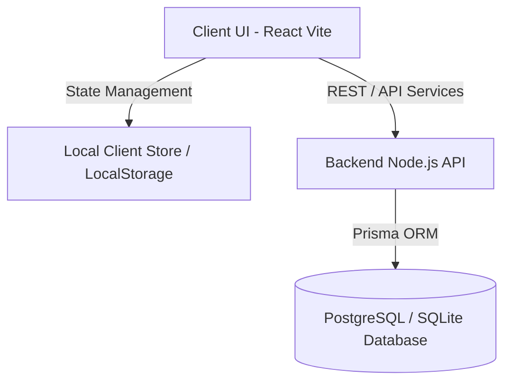
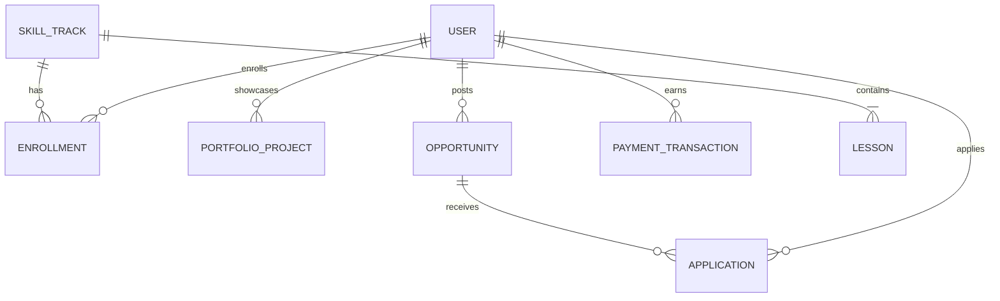

# HerEarn: Website Implementation Plan (Prototype)

**Project:** A website where women learn market-relevant skills, showcase their work, and connect with real income opportunities.

**Core loop:** Learn → Showcase → Earn

**Deadline:** tomorrow. The goal is a **live, working website** with a real frontend and a simple real backend, covering one complete user path from sign-up to applying for a gig.

**Status so far:** The landing page and navbar are done (React + Tailwind, pushed to GitHub). The plan below covers everything still to build.

---

## 1. Scope

### Must build (the demo path)

| # | Feature | Frontend page | Backend needed |
|---|---|---|---|
| 1 | Landing page | Home | No (done) |
| 2 | Sign up / login | Login, Signup | Yes (auth) |
| 3 | Profile setup | Profile | Yes |
| 4 | Learning track with progress | Courses, Lesson | Yes (progress) |
| 5 | Portfolio: add and view projects | Portfolio, Public Profile | Yes |
| 6 | Opportunity board + apply | Opportunities | Yes |
| 7 | User dashboard (progress, applications) | Dashboard | Yes |

### Keep simple or mock

- Lesson videos: embedded YouTube links
- Opportunities: seeded sample data (8 gigs and internships)
- Payments: "Coming soon" button only
- Matching: filter by skill tag and category

### Do NOT build tomorrow (mention in roadmap)

Mentorship, AI matching, real payments and escrow, mobile app, full multilingual translation, admin panel, employer dashboard.

---

## 2. Tech Stack

| Need | Choice | Why |
|---|---|---|
| Frontend | React (Vite) + Tailwind CSS | Fast to build, modular, looks great |
| Database & ORM | PostgreSQL / SQLite + Prisma / SQL DDL | Structured relational model for scalable backend |
| State & Storage | LocalStorage + React State | Fast, persistent offline prototype loop |
| Content | Embedded YouTube links | Practical learning tracks |
| Hosting | Vercel / GitHub Pages | Instant deployment |

---

## 3. Architecture & Data Design

### 3.1 Demo Path & End-to-End Loop

1. **Sign Up / Login**: Register or 1-click sign in.
2. **Dashboard**: View enrolled courses, earnings, active gigs, and quick shortcuts.
3. **Learn Track**: Watch bite-sized video lessons & mark lessons complete to increase track progress.
4. **Showcase Portfolio**: Submit verified projects (title, category, image/link, description).
5. **Opportunity Board**: Filter gigs by skill tag/category & submit application with attached portfolio.

### 3.2 System Architecture Diagram

### 3.3 Database Models & Data Schemas (Task 3.3 Completed)

Below are the 8 core database entities designed for the HerEarn platform architecture:

#### Entity Relationship Overview

#### 1. User (`users`)
- `id` (UUID, Primary Key)
- `name` (String, Required)
- `email` (String, Unique, Required)
- `passwordHash` (String, Required)
- `role` (Enum: `LEARNER`, `EMPLOYER`, `ADMIN`, Default: `LEARNER`)
- `avatar` (String, Optional)
- `phone` (String, Optional)
- `location` (String, Optional)
- `bio` (Text, Optional)
- `skills` (Array of Strings)
- `totalEarned` (Decimal/Float, Default: 0.00)
- `createdAt` / `updatedAt` (Timestamp)

#### 2. SkillTrack (`skill_tracks`)
- `id` (UUID, Primary Key)
- `title` (String)
- `category` (String: Marketing, Design, Business, Tech)
- `icon` (String)
- `duration` (String)
- `level` (Enum: `BEGINNER`, `INTERMEDIATE`, `ADVANCED`)
- `instructor` (String)
- `description` (Text)
- `image` (URL String)
- `createdAt` / `updatedAt` (Timestamp)

#### 3. Lesson (`lessons`)
- `id` (UUID, Primary Key)
- `trackId` (UUID, Foreign Key -> `skill_tracks.id`)
- `title` (String)
- `duration` (String)
- `videoUrl` (String, YouTube Embed URL)
- `summary` (Text)
- `keyTakeaways` (Array of Strings)
- `orderIndex` (Integer)

#### 4. Enrollment (`enrollments`)
- `id` (UUID, Primary Key)
- `userId` (UUID, Foreign Key -> `users.id`)
- `trackId` (UUID, Foreign Key -> `skill_tracks.id`)
- `completedLessonIds` (Array of Strings)
- `progressPercent` (Float: 0 to 100)
- `isCompleted` (Boolean, Default: false)
- `completedAt` (Timestamp, Nullable)
- `lastAccessedAt` (Timestamp)

#### 5. PortfolioProject (`portfolio_projects`)
- `id` (UUID, Primary Key)
- `userId` (UUID, Foreign Key -> `users.id`)
- `title` (String)
- `category` (String)
- `description` (Text)
- `imageUrl` (URL String)
- `projectUrl` (URL String, Optional)
- `tags` (Array of Strings)
- `likesCount` (Integer, Default: 0)
- `verified` (Boolean, Default: false)
- `createdAt` / `updatedAt` (Timestamp)

#### 6. Opportunity (`opportunities`)
- `id` (UUID, Primary Key)
- `postedById` (UUID, Foreign Key -> `users.id`)
- `title` (String)
- `company` (String)
- `logo` (URL String, Optional)
- `stipend` (String: e.g. "₹8,000 / month")
- `type` (Enum: `MICRO_GIG`, `REMOTE_INTERNSHIP`, `FREELANCE`, `FULL_TIME`)
- `category` (String)
- `skillsRequired` (Array of Strings)
- `duration` (String)
- `description` (Text)
- `deliverables` (Array of Strings)
- `verifiedClient` (Boolean, Default: true)
- `isOpen` (Boolean, Default: true)
- `applicantsCount` (Integer, Default: 0)
- `deadline` (Timestamp)

#### 7. Application (`applications`)
- `id` (UUID, Primary Key)
- `opportunityId` (UUID, Foreign Key -> `opportunities.id`)
- `userId` (UUID, Foreign Key -> `users.id`)
- `coverNote` (Text)
- `portfolioProjectIds` (Array of Foreign Keys -> `portfolio_projects.id`)
- `status` (Enum: `SUBMITTED`, `UNDER_REVIEW`, `SHORTLISTED`, `ACCEPTED`, `REJECTED`)
- `appliedAt` (Timestamp)

#### 8. PaymentTransaction (`payment_transactions`)
- `id` (UUID, Primary Key)
- `userId` (UUID, Foreign Key -> `users.id`)
- `opportunityId` (UUID, Foreign Key -> `opportunities.id`, Optional)
- `amount` (Decimal/Float)
- `currency` (String, Default: "INR")
- `type` (String, Default: "GIG_PAYOUT")
- `status` (Enum: `PENDING`, `COMPLETED`, `FAILED`)
- `transactionDate` (Timestamp)

---

## 4. Schema Files Implementation

The database schemas have been generated and configured in the repository:
1. **Prisma ORM Schema**: [`prisma/schema.prisma`](file:///c:/Users/YASHI%20AADARSH/Desktop/IEEE/IEEE/prisma/schema.prisma)
2. **PostgreSQL Relational SQL DDL**: [`src/models/schema.sql`](file:///c:/Users/YASHI%20AADARSH/Desktop/IEEE/IEEE/src/models/schema.sql)
3. **JavaScript Entity Models & Specifications**: [`src/models/dbSchemas.js`](file:///c:/Users/YASHI%20AADARSH/Desktop/IEEE/IEEE/src/models/dbSchemas.js)

---

## 5. Checklist & Submission Readiness

- [x] Clean Vite + React architecture (no hardcoded inline scripts)
- [x] Fully responsive Light Mode and Dark Mode support
- [x] Dynamic Dashboard with stats, course progress, active gigs, and modal shortcuts
- [x] Verified project portfolio submission modal
- [x] Interactive micro-gig application modal
- [x] About Us & Terms & Conditions policies in 3-dot dropdown menu
- [x] **Task 3.3 Database Models**: Complete Prisma ORM schema, SQL DDL tables, and JS data models created
- [x] Pushed to Git branch `yashi`